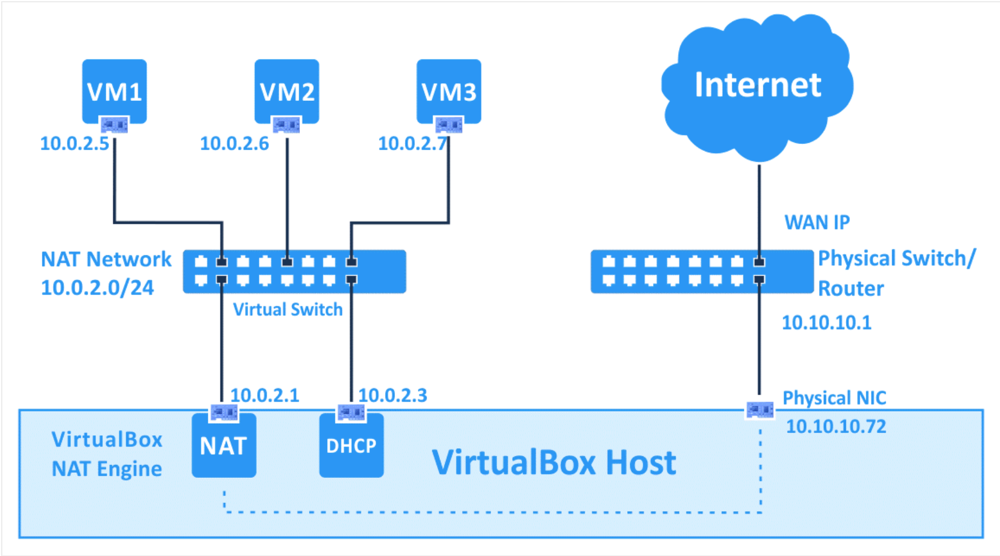
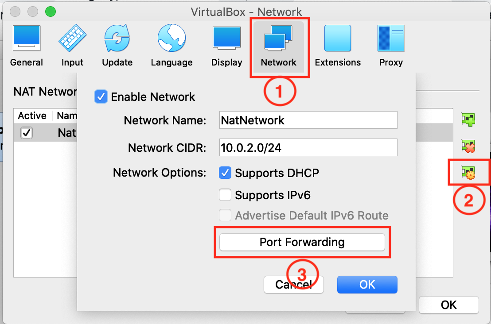
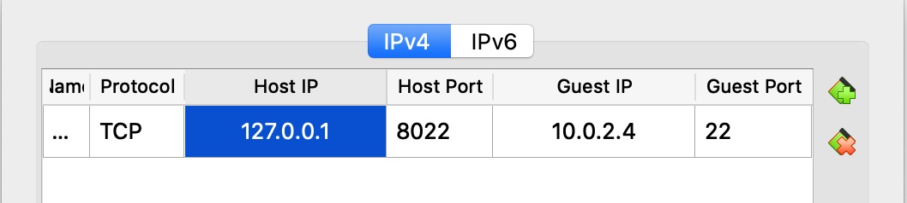
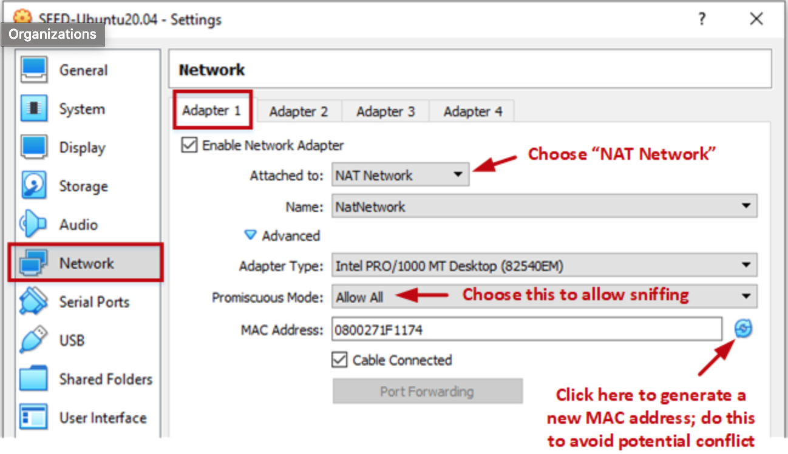

Quickly configure your VS Code installed in Host (a.k.a. local machine) to develop in Guest (i.e., remote machine, remote server, virtual machine in VirtualBox or Cloud).

## Step 1: Create a Virtual Machine (VM)

Please refer to [Install SEED VM on VirtualBox](https://github.com/seed-labs/seed-labs/blob/master/manuals/vm/seedvm-manual.md). Skip if you have one.

> username: seed  
> password: dees

## Step 2: Set Up SSH Server Service in VM

```bash
## Install sshd server
sudo apt install openssh-server

## Start server and check status
sudo service ssh start
sudo service ssh status

## Further config sshd server only when needed
# sudo vim /etc/.ssh/sshd_config
# sudo service ssh restart

## Verify ssh login
# tip: use `whoami` to display your username
ssh seed@127.0.0.1
```

## Step 3: Add Port Forwarding Rule in VirtualBox

Go to VirtualBox/Preferences/Network (VirtualBox 6.x), edit your NATNetwork and select Port Forwarding. Add Rules as follows.

> Name: SSH (any arbitrary unique name)  
> Protocol: TCP  
> Host IP: 127.0.0.1 (any available ip of your local machine)  
> Host Port: 8022 (any unused port higher than 1024)  
> Guest IP: 10.0.2.4 (type `ifconfig` in terminal of VM to check)  
> Guest Port: 22 (SSH default port)

<!-- The following figure shows what NAT Network looks like. Please refer to [VirtualBox Network Settings: Complete Guide](https://www.nakivo.com/blog/virtualbox-network-setting-guide/) or [Virtual Networking](https://www.virtualbox.org/manual/ch06.html) if interested.
 -->




After adding the rule, modify the network configuration of VM to use NAT Network.



## Step 4: Set Up SSH Client Service in Host

### Install ssh client

For macOS Host, it comes pre-installed. For Ubuntu Host, Debian/Ubuntu Run `sudo apt-get install openssh-client`. For other OS, please refer to [Install a supported SSH client](https://code.visualstudio.com/docs/remote/troubleshooting#_installing-a-supported-ssh-client).

### Connect VM by SSH

```bash
ssh seed@127.0.0.1 -p 8022
```

### Set up password-free login (Optional)

Do the following substeps in your local machine if you want password-free login.

```bash
# Lists the files in your .ssh directory, if they exist
ll ~/.ssh

# Generate a new key if needed with RSA 2048⁄4096 or Ed25519
# Just don’t use ECDSA/DSA!
ssh-keygen -t ed25519

# Start the ssh-agent in the background
eval "$(ssh-agent -s)"

# Add your SSH private key to the ssh-agent
ssh-add ~/.ssh/id_ed25519

# Copy public key to VM
ssh-copy-id seed@127.0.0.1 -p 8022

# Now try again to log in with no password required
ssh seed@127.0.0.1 -p 8022
```

Please refer to [How to Set Up SSH Keys on Ubuntu 20.04](https://www.digitalocean.com/community/tutorials/how-to-set-up-ssh-keys-on-ubuntu-20-04) or [Connecting to GitHub with SSH](https://docs.github.com/en/authentication/connecting-to-github-with-ssh) for more info.

If you want further simplify the connection, open `~/.ssh/config` in your local machine and append the following ssh config.

```ssh_config
Host sd
    HostName 127.0.0.1
    User seed
    # replace id_ed25519 with your secret key
    IdentityFile ~/.ssh/id_ed25519
    Port 8022
```

Now try to login by

```bash
ssh sd
```

## Step 5: Install VSCode and Remote SSH Extension

Install VSCode in your local machine and install `Remote - SSH` extension in VSCode, and click the bottom left `><` icon to use it. All the extensions I prefer are listed below.

> **Remote**
>
> Remote - SSH  
> Remote - SSH: Editing Configuration Files
>
> **Hex** (Optional)
>
> Hex Editor
>